**3D printing med OpenScad**

**Bok 1**

2026-03-10 Atombjörn

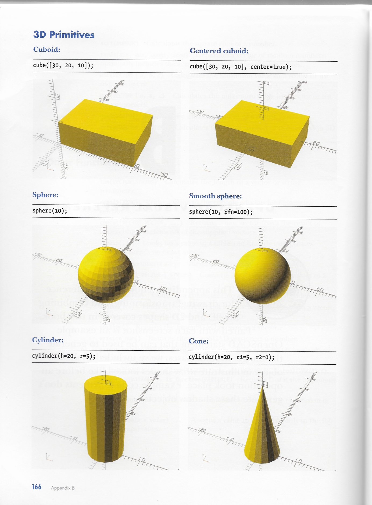{width="2.949215879265092in"
height="2.422871828521435in"}

**\_\_\_\_\_\_\_\_\_\_\_\_\_\_\_\_\_\_**

Beskrivning

Introduktion

Skapa en kub

Rendera. En stl fil skapas

Öppna PrusaSlicer

Slica. En .gcode fil skapas

Sänd .gcode till 3D printern med USB-sticka.

Sänd .gcode till 3D printern med WiFi.

**Innehåll**

Förord

OpenScad

Byggelement, Primitives

**Förord**

Det här är en bok som vill introducera 3D printing för **alla**.

Du behöver inga förkunskaper!!

Bara att du är nyfiken och vill komma igång med 3D.

Från ide till färdig figur.

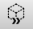{width="6.295833333333333in"
height="1.4152777777777779in"}

Du har en ide om vad du vill skriva ut i 3D. Du skapar det i ett
CAD-program,

Computer Aided Design.

I CAD-programmets bildfönster bygger du upp ditt projekt.

I programmet finns det en funktion *rendera* som skapar en stl-fil
(Standard Tessellation Language) om slicern importerar och förädlar till
en gcode fil.

Gcode-filen sänds antingen med en USB eller via WiFi till skrivaren.

**OpenScad**

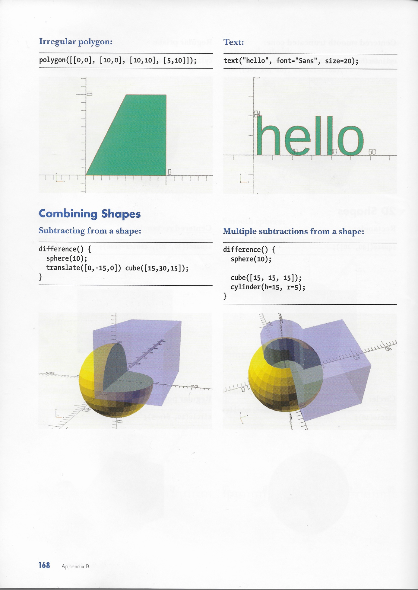{width="4.2201837270341205in"
height="5.509142607174104in"}

Ett exemplar finns på Makerspace.

OpenScad finns på UMS datorer.

Jag har valt OpenScad för att jag kan det och för att det ger en ingång
till programmering.

*OpenScad* är en textbaserad mjukvara till för att skapa solida 3D
modeller. Du designar dina modeller med en *skriven kod*. Det ger dig
full kontroll över modelleringsprocessen och gör det enkelt att göra
ändringar.

Programmet har ett antal byggelement, PRIMITIVES, vilka kan kombineras
och förändras på tusentals sätt.

**PRIMITIVES**

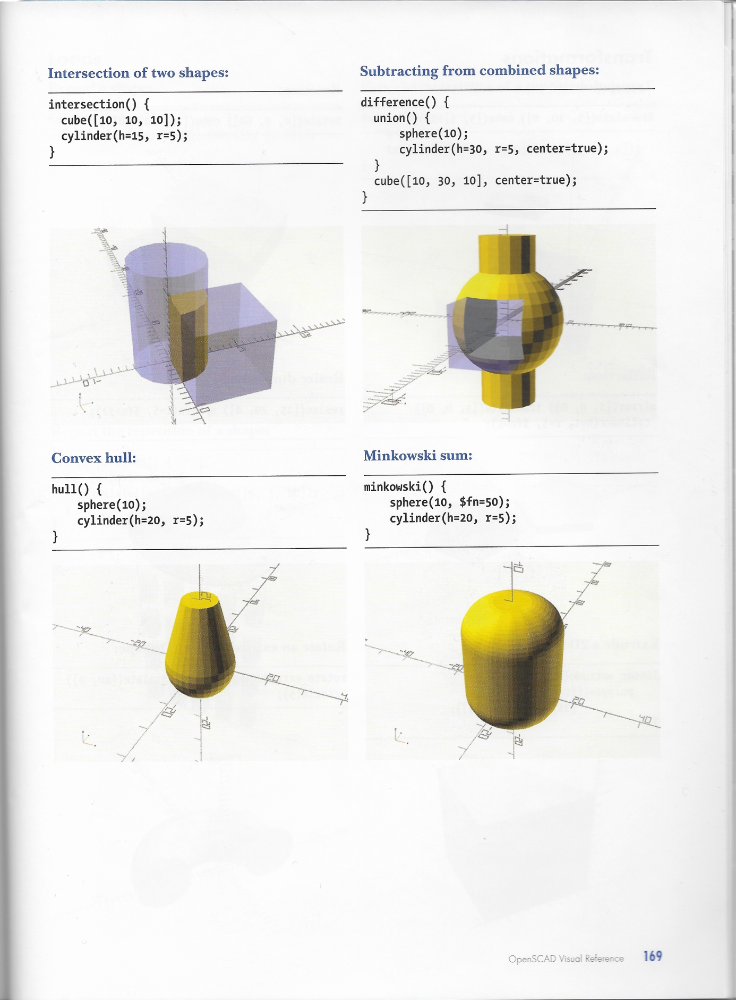{width="5.916816491688539in"
height="8.009174321959755in"}ALLT om primitives och hur dom kan
kombineras finns i boken

"Programming with OPENSCAD"

*En första demo.*

Innan du fortsätter skall du ha skapat en mapp där du sparar dina filer.

När du öppnar programmet ser du:

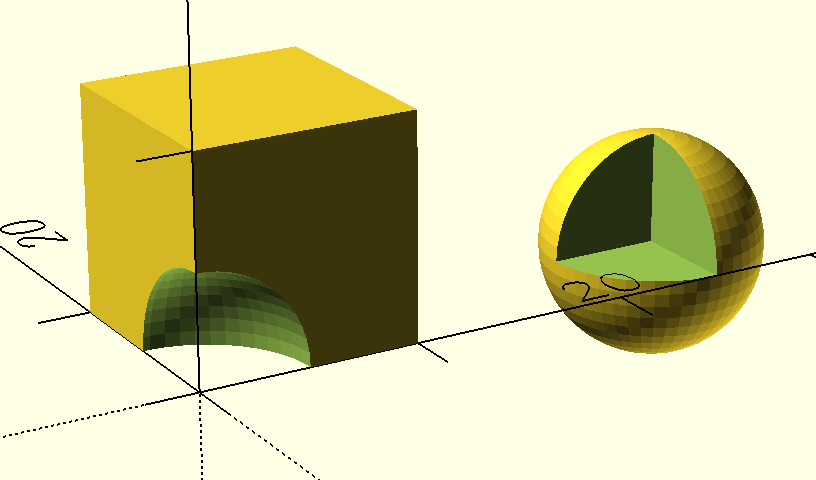{width="5.440367454068242in"
height="3.597661854768154in"}

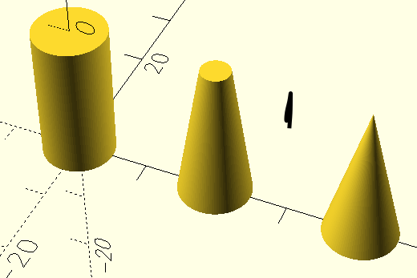{width="5.504166666666666in"
height="0.4311931321084864in"}

Och ett tomt fält EDITORN till vänster om BILDFÄLTET.

**Steg 1: Skapa en kub.**

Skriv i editorn: OBS! semikolon ;

cube(10);

Kör genom att trycka på
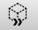{width="0.5326509186351706in"
height="0.4311931321084864in"} Vips så dyker det upp en kub i
bildfältet.

Döp modellen och spara den. Den sparade filen har fått tillägget
***.scad***

**Steg 2: Rendera**

Tryck på {width="0.5045877077865267in"
height="0.3834864391951006in"} En ***stl*** fil skapas. Det syns inte.

Tryck på 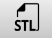{width="0.5272834645669291in"
height="0.3853215223097113in"} Du ombeds att spara filen. Den får samma
namn som scad-filen med tillägget ***.stl***.

**Steg 3: Slica**

Öppna programmet PrucaSlicer!

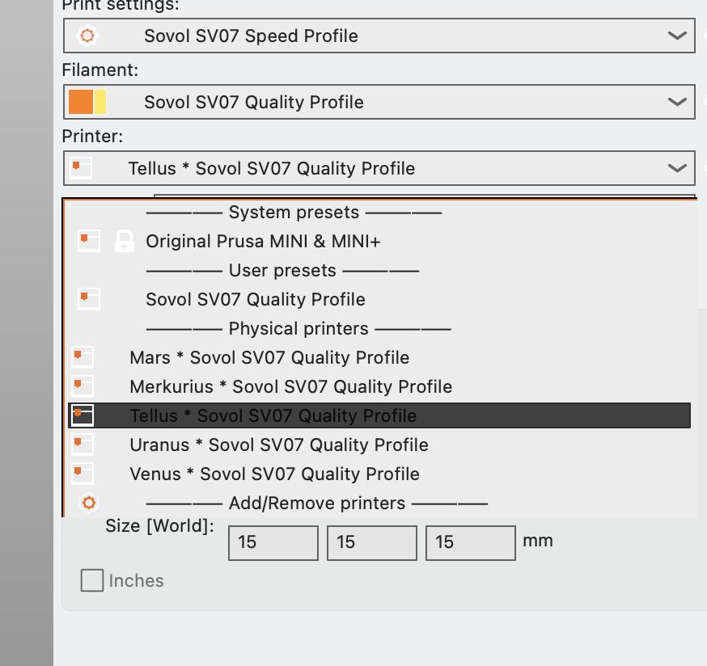{width="3.3961209536307964in"
height="3.2018350831146107in"}

Välj en printer och starta den. Skriv upp printerns IP-adress.

Under **File** i menyn hittar du **Import.**

Leta reda på din **.stl** fil där du sparat den.

Importera! Välj: Import/STL/3MF/STEP....

Ditt objekt dyker upp på **Platan.** (Plater).

Tryck på **Slice now**

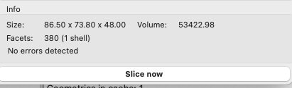{width="4.055045931758531in"
height="1.2264041994750656in"}

Tryck på **Export G-code**

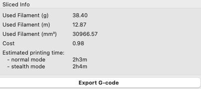{width="4.339449912510936in"
height="1.9334186351706037in"}

Spara filen som fått samma namn som scad-filen.

**Steg 4a: Skriv ut med USB-sticka.**

Kopiera filen till en USB som du sätter i din utvalda 3D printer.

PRINTA!

**Steg 4b: Skriv ut med WiFi.**

Starta webbläsare CROME.

Ange skrivarens IP-adress.

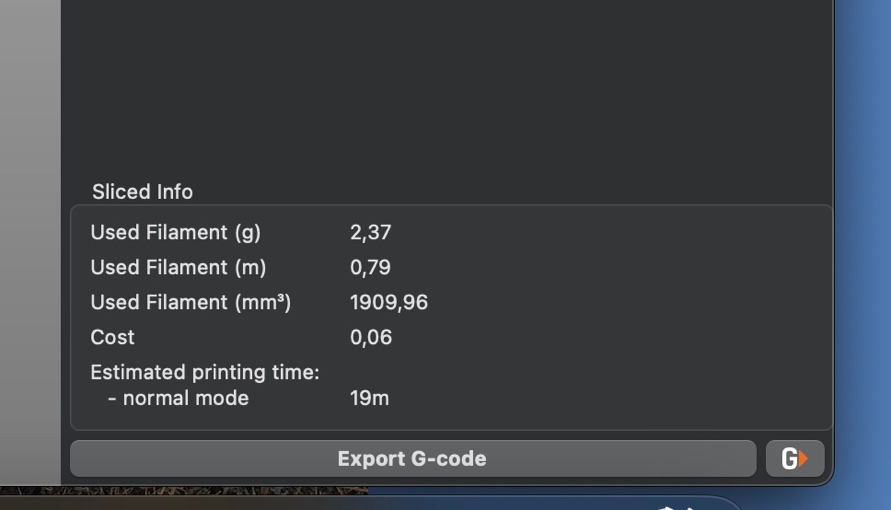{width="3.9819061679790027in"
height="2.279076990376203in"}

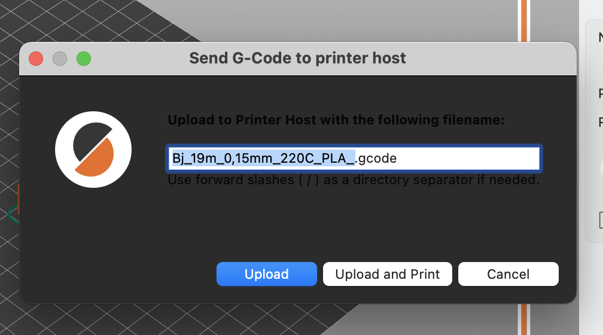{width="3.98125in"
height="2.211953193350831in"}

Bilden visar hur lång tid det tar att skriva ut modellen. *Estimated
printing time*.

Tryck på G. För några skrivare syns inte G.et, men det går bra ändå.

Din fil får ett namn med suffixet .gcode

Tryck UPLOAD&PRINT

Tryck ENTER att starta utskriften. OBS! UTSKRIFTEN STARTAR PÅ EN GÅNG

**Egen dator**

Om du har egen dator behöver du ladda ner config filer till SOVOL
printrarna.

Filerna bör finas på ett USB-minne som Björn Engström har????

Jag vet ej hur man installerar dem???

{width="1.0642202537182852in"
height="1.0642202537182852in"}
