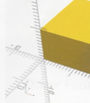

**3D printing med OpenScad**

**Bok 2**

2026-03-17 Atombjörn

\_\_\_\_\_\_\_\_\_\_\_

Beskrivning

Koordinatsystem

Parenteser

Ändra storlek och form på kuben

Flytta med *translate*

Utforska \$fn

Gör ett hål med *difference*

**KOORDINATSYSTEM**

**PARENTESER**

**( shift 8 ) shift 9**

**\[ alt 8 \] alt 9**

**{ alt shift 8 } alt shift 9**

**\$ alt 4**

**Uppgift 1: Skapa en kub.**

Skriv: OBS! semikolon ;

cube(10);

Kör genom att trycka på

 Vips så dyker det upp en kub i
bildfältet.

Prova!

cube(\[10,20,30\]);

 En ny kub träder fram.

**Uppgift 2: Flytta kuben.**

För att flytta kuben använder vi **translate(\[x,y,z\])**

translate(\[x,y,z\]) OBS! Inget semikolon vid tanslate.

cube(\[10,20,30\]);

Du kan vrida och vända figurerna i bildfältet genom att hålla ner
vänster knapp och röra den fram och tillbaka.

Experimentera med olika värden för kuben och x,y,x!

Det är den punkten som flyttas när koordinaterna i translate ändras.

**Uppgift 3: Utforska \$fn.**

Rensa EDITORN!

Skriv följande:

x = 1;

**\$fn = x ;**

sphere(10);

translate(\[20,0,0\])

cylinder(h=10,r=5);

translate(\[20,0,0\])

cube(10);

Variera värdet på x från 1 till 200 och se vad som händer!

**Uppgift 4: Gör ett hål i en kub.**

Rensa EDITORN!

Skriv:

\$fn = 50;

difference() {

cube(10);

translate(\[5,5,-0.2\])

cylinder(h=15,r=4);

}

**Uppgift 5: Skär bitar ur en kub och ur en sfär.**

\-\-\-\-\-\-\-\-\-\-\-\-\-\-\-\-\-\-\-\-\-\-\-\-\-\-\-\-\-\-\-\-\-\-\-\-\--

5a

\$fn = 50;

difference() {

cube(\[10,10,10\]);

sphere(5);

}

\-\-\-\-\-\-\-\-\-\-\-\-\-\-\-\-\-\-\-\-\-\--

5b

translate(\[15,0,0\])

difference() {

translate(\[10,5,0\])

sphere(5);

cube(\[10,5,10\]);

}

Observera att i 5a skär man ur sfären ur kuben medans man i 5b skär
kuben ur sfären.

**Uppgift 6: Gör en kon**

Rensa EDITORN!

Skriv följande:

x = 100;

\$fn = x ;

cylinder(h=20,r1=5,r2=5);

translate(\[20,0,0\])

cylinder(h=20,r1=5,r2=2);

translate(\[40,0,0\])

cylinder(h=20,r1=5,r2=0);

**Uppgift 7: Öppna OpenScad Hompage.**

I huvudmenyn välj

Help

Dokumentation

Här hittar du **Tutorial** med mänger av övningsuppgifter.
