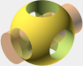

---
tags:
  - OpenSCAD
  - kurs
  - course
---

# OpenSCAD kurs

OpenSCAD kurs är en kurs hos
[Uppsala Makerspace](https://www.uppsalamakerspace.se/),
var man lär sig att designa 3D modeller med OpenSCAD.

- För vem: medlemmar av [Uppsala Makerspace](https://www.uppsalamakerspace.se/)
  av ålder 8 och äldre
- Var: [Uppsala Makerspace](https://www.uppsalamakerspace.se/),
  allmänrum 1:e våningen
- När:
    - Onsdager 19.00-21.00 (19 augusti och senare)
    - Lördager 13.00-15.00 (5 september och senare)
      under [Lördagskurserna](https://uppsala-makerspace.github.io/loerdagskurser/)
- [Veckoschemat](veckoschemat.md)
- [Böcker](boecker.md)
- [Vanliga frågor](vanliga_fraagor.md)
